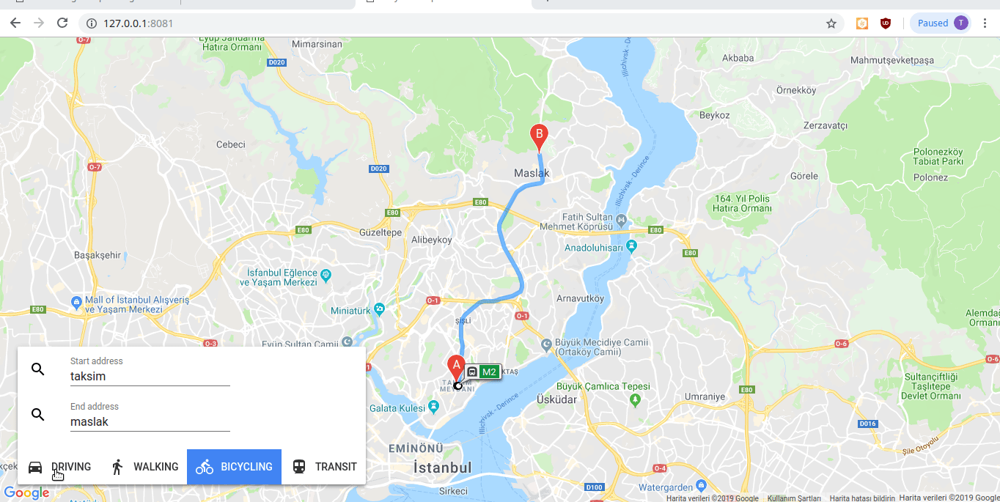

Polymer 3.x Google Maps Codelab
===
See [instructions](https://comcastsamples.github.io/polymer-maps/) for codelab instructions and [original github repo](https://github.com/ComcastSamples/polymer-maps)

I just applied them to how it work. 

## Result

